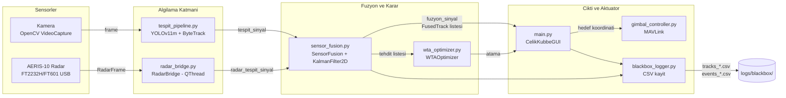
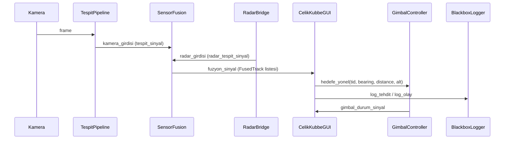

# Çelik Kubbe — Sistem Mimarisi

Bu belge, ana modüller arası veri akışını ve sorumluluk bölünmesini özetler. Ayrıntılı algoritma detayları için [SENSOR_FUSION.md](SENSOR_FUSION.md) belgesine bakın.

## Üst Seviye Akış



## Modul Sorumluluklari

| Modul | Tip | Sorumluluk |
|-------|-----|------------|
| `tespit_pipeline.TespitPipeline` | QThread | YOLOv11 inference + ByteTrack — kameradan tespit_sinyal yayin |
| `radar_bridge.RadarBridge` | QThread | USB FTDI baglanti, RadarFrame al, CFAR tespit cikarma, radar_tespit_sinyal yayin |
| `sensor_fusion.SensorFusion` | QObject | Radar+Kamera tespitlerini esleştir, FusedTrack olustur, Kalman ile filtrele, XAI tehdit skoru |
| `kalman_filter.KalmanFilter2D` | yardimci | 2D lineer Kalman filter, state=[x,y,vx,vy] |
| `wta_optimizer.WTAOptimizer` | static | Tehdit-batarya atama optimizasyonu |
| `gimbal_controller.GimbalController` | QObject | MAVLink ile pan/tilt, mock fallback |
| `blackbox_logger.BlackboxLogger` | QThread | tracks/events CSV |
| `main.CelikKubbeGUI` | QMainWindow | UI, sinyal dispatchi, kullanici kontrolu |

## Sinyal-Slot Topolojisi



## Calistirma Modu

`config.yaml` icindeki bayraklar:

| Bayrak | Mock anlami | Gercek anlami |
|--------|-------------|---------------|
| `radar.mock` | radar_protocol.FT2232HConnection(mock=True) — sentetik veri | Gercek FTDI USB acilir |
| `gimbal.mock` | komutlar yalnizca sinyal yayinlar, donanima gitmez | pymavlink.mavutil baglantisi |
| `radar.aktif` | RadarBridge baslatilmaz | RadarBridge baslatilir |
| `fuzyon.aktif` | SensorFusion devre disi | SensorFusion baglanir |

Hibrit mod desteklenir (orn. `radar.mock=True, gimbal.mock=False`) — modullerin baglanti adimlari bagimsizdir.

## Kara Kutu Veri Bicimi

`logs/blackbox/tracks_YYYYMMDD_HHMMSS.csv` sutunlari:
```
Timestamp, Threat_ID, Class, Threat_Level, Range_km, Bearing_deg, Velocity_ms, Altitude_m, Source, Status
```

`Source` alani: `fuzyon` | `yalniz_radar` | `yalniz_kamera`. Gorev sonrasi analiz icin kritik metadata.
